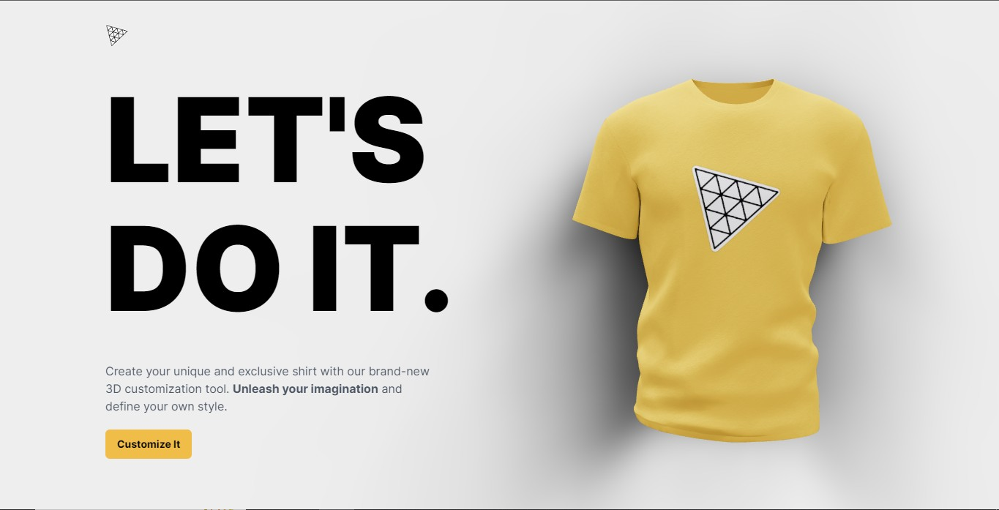

# T-Shirt 3D Customizer With ChatGPT 👕 

T-Shirt 3D Customizer With ChatGPT is a fun and interactive project that allows users to make their own customized t-shirt by selecting their preferred color and design. Additionally, users can even ask ChatGPT to make their custom t-shirt using natural language prompts.

## Installation

1. Clone this repository to your local machine.
2. Install the required dependencies by running `npm install`.

## Dependencies

### Server

| Icon | Name | Version |
| --- | --- | --- |
|  | cloudinary | ^1.35.0 |
|  | cors | ^2.8.5 |
|  | dotenv | ^16.0.3 |
|  | express | ^4.18.2 |
|  | mongoose | ^7.0.3 |
|  | nodemon | ^2.0.22 |
|  | openai | ^3.2.1 |

### Client

| Icon | Name | Version |
| --- | --- | --- |
|  | React | ^18.2.0 |
|  | React-DOM | ^18.2.0 |
|  | Three.js | ^0.151.2 |
|  | React-Color | ^2.19.3 |
|  | MAATH | ^0.5.3 |
|  | Valtio | ^1.10.3 |
|  | Framer-Motion | ^10.10.0 |
|  | React-Three/Drei | ^9.61.3 |
|  | React-Three/Fiber | ^8.12.0 |

### Dev Dependencies

| Icon | Name | Version |
| --- | --- | --- |
|  | Vite | ^4.2.0 |
|  | Autoprefixer | ^10.4.14 |
|  | PostCSS | ^8.4.21 |
|  | TailwindCSS | ^3.3.1 |
|  | Vite-Plugin-React | ^3.1.0 |
|  | React-Types | ^18.0.28 |
|  | React-DOM-Types | ^18.0.11 |

## Usage

To use this project, follow these steps:

1. Start the server using `npm start`.
2. Open the project in your web browser through `localhost:3000`.
3. Customize your t-shirt using the options on the screen.
4. Ask ChatGPT to make your t-shirt by using natural language prompts.
5. Submit your order and wait for it to be delivered!

## Contributing

Contributions are always welcome! Please fork this repository and submit a pull request.

## Credits

This project was inspired by JsMastery.

## License

Distributed under the MIT License. Feel free to use this project as a template and replace the content with your own project details. If you have any questions, please let me know!
